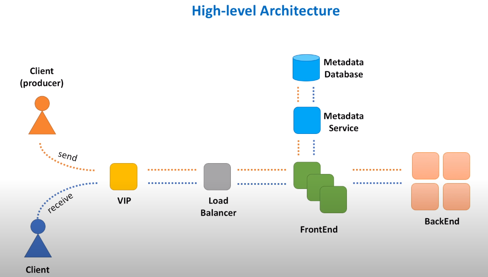
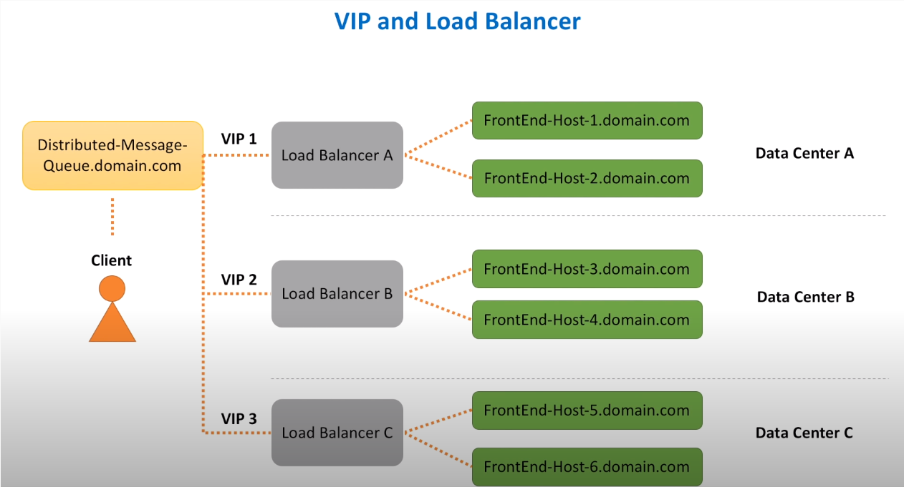

#### Excerpted from [here](https://youtu.be/iJLL-KPqBpM){:target="_blank"}

-----------------------

### Synchronous Communication
- When producer makes a call to a consumer, waits for a response. 
- Easier and faster to implement. 
- Harder to deal with consumer service failures. Need to think;
  - When and how to properly retry failed requests? 
  - How not to overwhelm consumer service with too many requests?
  - How to deal with a slow consumer service host? 

### Asynchronous Communication
- Queue : Producer sends data to that component and exactly one consumer gets this data to a short time after.
- It is distributed, because data is stored across several machines. 
- Do not confuse queue with topic. In case of a topic, message goes to all subscribers. In case of a queue, message is received by only one consumer. 

-----------------------

### Functional Requirements
- sendMessage(messageBody) 
- receiveMessage() 

### Non-Functional Requirements
- Scalable (handle load increasses, more queues, messages)
- Highly Available (tolerates hardware / network failures)
- Highly Performant (single digit latency, both send and receive operations are fast)
- Durable (once submitted, data is not lost, so persistent)

-----------------------

### High-level Architecture

- VIP : Virtual IP : Refers to the symbolic hostname (myWebService.domain.com) that resolves to a load balancer system. 
- Load Balancer : A device that routes client requests across a number of servers. 
- FrontEnd Web Service : A component responsible for initial request processing, like validation, authentication. 
- Queue Metadata : Queue's name, creation date / time, owner and any other configuration settings will be stored in a DB. 
- Metadata service : As a best practice, this metadata DB should be hidden behind some interface, a dedicated web service responsible for handling calls to that DB. 
- BackEnd Web Service : Responsible for message persistence and processing. 

### VIP and Load Balancer

- When domain name is hit, request is transferred to one of the VIPs registered in DNS for our domain name.
- VIP is resolved to a load balancer device, which has a knowledge of FrontEnd hosts.
- Several Points: 
  - First, load balancer seems like a single point of failure. What happens if load balancer device goes down?
  - Second, load balancers have limits with regards to number of requests they can process and number of bytes they can transfer. What happens when our distributed message queue service becomes so popular that load balancer limits are reached? 
- To address high availability concerns, load balancers utilize a concept of primary and secondary nodes. The primary node accepts connections and serves requests while the secondary node monitors the primary. If, the primary node is unable to accept connections, the secondary node takes over. 
- As for scalability concerns, a concept of multiple VIPs (sometimes referred as VIP partitioning) can be utilized. In DNS we assign multiple A-records to the same DNS name for the service. As a result, requests are partitioned across several load balancers.
- And by spreading load balancers across several data centers, we improve both availability and performance. 

### FrontEnd Service

- FrontEnd is a lightweight web service, consisting of stateless machines located across several data centers. 
- FrontEnd service is responsible for:
  - Request validation : Helps to ensure that all the required parameters are present in the request and values of these parameters honor constraints. For example, in our case we want to make sure queue name comes with every send message request. And message size does not exceed a specified threshold.
  - Authentication and authorization : During authentication check we verify that message sender is a registered customer of our distributed queue service. And during authorization check we verify that sender is allowed to publish messages to the queue it claims.
  - SSL termination : TLS is a protocol that aims to provide privacy and data integrity. TLS termination refers to the process of decrypting request and passing on an unencrypted request to the backend service. And we want to do TLS termination on FrontEnd hosts because TLS on the load balancer is expensive. Termination is usually handled by not a FrontEnd service itself, but a separate HTTP proxy that runs as a process on the same host.
  - Server-side data encryption : Because we want to store messages securely on backend hosts, messages are encrypted as soon as FrontEnd receives them. Messages are stored in encrypted form and FrontEnd decrypts them only when they are sent back to a consumer.
  - Caching : Cache stores copies of source data. In FrontEnd cache we will store metadata information about the most actively used queues. As well as user identity information to save on calls to authentication and authorization services.
  - Rate limiting (Throttling) : Rate limiting or throttling is the process of limiting the number of requests you can submit to a given operation in a given amount of time. Throttling protects the web service from being overwhelmed with requests. Leaky bucket algorithm is one of the most famous.
  - Request dispatching : FrontEnd service makes remote calls to at least two other web services: Metadata service and backend service. FrontEnd service creates HTTP clients for both services and makes sure that calls to these services are properly isolated. It means that when one service let's say Metadata service experiences a slowdown, requests to backend service are not impacted. There are common patterns like bulkhead and circuit breaker that helps to implement resources isolation and make service more resilient in cases when remote calls start to fail.
  - Request deduplication : It may occur when a response from a successful send message request failed to reach a client. Lesser an issue for 'at least once' delivery semantics, a bigger issue for 'exactly once' and 'at most once' delivery semantics, when we need to guarantee that message was never processed more than one time. Caching is usually used to store previously seen request ids to avoid deduplication.
  - Usage data collection : When we gather real-time information that can be used for audit. 
- And even though FrontEnd service has many responsibilities, the rule of thumb is to keep it as simple as possible. 

