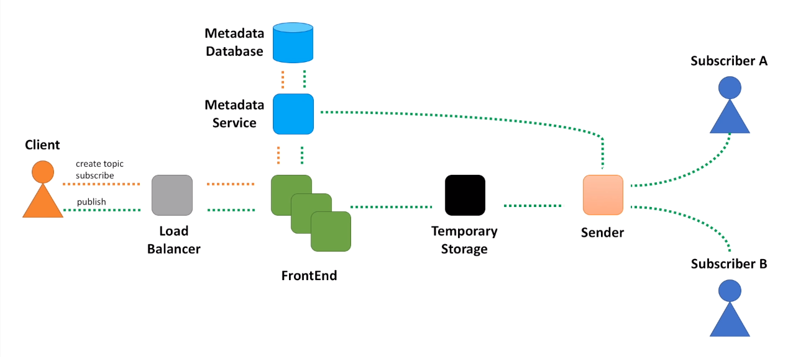

#### Excerpted from [here](https://youtu.be/bBTPZ9NdSk8){:target="_blank"}

-----------------------

- There is a component called Publisher which produces messages that need to be delivered to a group of other components, called Subscribers.
- We could have setup a synchronous communication between Publisher and Subscribers, when Publisher calls each Subscriber in some order and waits for the response.
- But this introduces many different challenges: hard to scale such system when number of subscribers and messages grow and hard to extend such solution to support different types of subscribers.
- Instead, we can introduce a new system that can register an arbitrary large number of publishers and subscribers and coordinates message delivery between them.
- When we talk about functional requirements, we want to define system behavior, or more specifically APIs - a set of operations the system will support.
- When we talk about non-functional requirements, we basically mean such system qualities as scalability, maintainability, testability and others.

-----------------------

### Functional Requirements
- createTopic(topicName) 
- publish(topicName, message)
- subscribe(topicName, endpoint) 

### Non-Functional Requirements
- Scalable (supports an arbitrarily large number of topics, publishers and subscribers)
- Highly Available (tolerates hardware / network failures, no single point of failure)
- Highly Performant (keep end-to-end latency as low as possible, so that messages are delivered to subscribers as soon as possible)
- Durable (messages must not be lost, each subscriber must receive every message at least once)

- Topic : Represents a named resource to which messages are sent. You can think of it as a bucket that stores messages from a publisher and all subscribers receive a copy of a message from the bucket.

-----------------------

### High-level Architecture

- All requests coming from our clients will go through a load balancer first.
- This will ensure requests are equally distributed among requests processing servers.
- And the component that does this initial request processing is a FrontEnd service.
- We will use a database to store information about topics and subscriptions.
- We will hide the database behind another miscroservice, Metadata service.
- There are several reasons for this decision.
  - First, separation of concerns, a design principle that teaches us to provide access to the database through a well-defined interface. It greatly simplifies maintenance and ability to make changes in the future.
  - Second, Metadata service will act as a caching layer between the database and other components. We do not want to hit database with every message published to the system. We want to retrieve topic metadata from cache.
- Next, we need to store messages for some period of time.
- This period will generally be short if all subscribers are available and message was successfully sent to all of them.
- Or we may need to store messages a bit longer (say several days), so that messages can be retried later if some subscriber is not available right now.
- And one more component we need is the one that retrieves messages from the message store and sends them to subscribers.
- Sender also needs to call Metadata service to retrieve information about subscribers.
- When create topic and subscribe APIs are called, we just need to store all this information in the database.
- The pattern that consists of load balancer, frontend, metadata store and service is so common in the world of distributed systems, that you can apply it during many system design interview discussions.

### FrontEnd Service

- Look at the same service at [here](2020-01-14-system-design-interview-distributed-message-queue.md){:target="_blank"}
