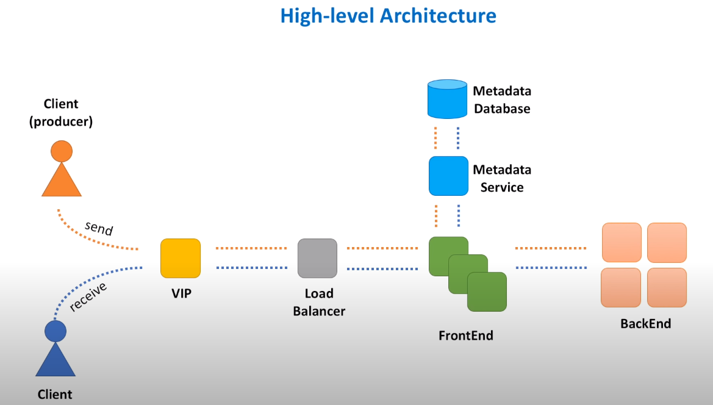

### High-level Architecture

- VIP : Virtual IP : Refers to the symbolic hostname (myWebService.domain.com) that resolves to a load balancer system. 
- Load Balancer : A device that routes client requests across a number of servers. 
- FrontEnd Web Service : A component responsible for initial request processing, like validation, authentication. 
- Queue Metadata : Queue's name, creation date / time, owner and any other configuration settings will be stored in a DB. 
- Metadata service : As a best practice, this metadata DB should be hidden behind some interface, a dedicated web service responsible for handling calls to that DB. 
- BackEnd Web Service : Responsible for message persistence and processing. 

[Prev - Non-Functional Requirements](system-design-interview-distributed-message-queue-non-functional-requirements) 

[Next - VIP and Load Balancer](system-design-interview-distributed-message-queue-vip-and-load-balancer) 
