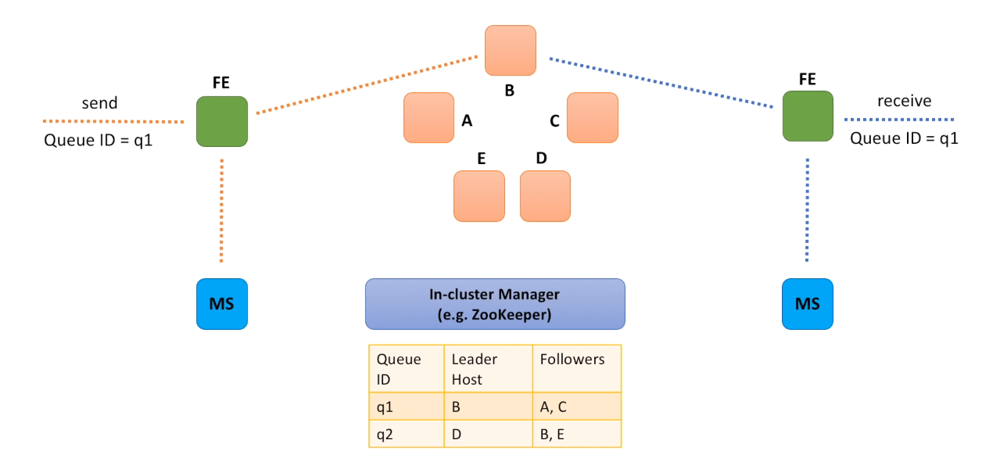

### Option A : Leader - Follower Relationship

- Each backend instance is considered a leader for a particular set of queues.
- And by leader we mean that all requests for a particular queue (like send message and receive message requests) go to this leader instance.
- Send message request comes to a FrontEnd instance.
- Message comes to a queue with ID equal to q1.
- FrontEnd service calls Metadata service to identify a leader backend instance for this queue.
- In this particular example, instance B is a leader for q1.
- Message is sent to the leader and the leader is fully responsible for data replication.
- When receive message request comes to a FrontEnd instance, it also makes a request to the Metadata service to identify the leader for the queue.
- Message is then retrieved from the leader instance and leader is responsible for cleaning up the original message and all the replicas.
- We need a component that will help us with leader election and management.
- Let's call it In-cluster manager.
- And as already mentioned, in-cluster manager is responsible for maintaining a mapping between queues, leaders and followers.
- In-cluster manager is a very sophisticated component.
- It has to be reliable, scalable and performant.

[Prev - BackEnd Service](system-design-interview-distributed-message-queue-backend-service) 

[Next - Option B : Small cluster of independent hosts](system-design-interview-distributed-message-queue-option-b-small-cluster-of-independent-hosts)  
