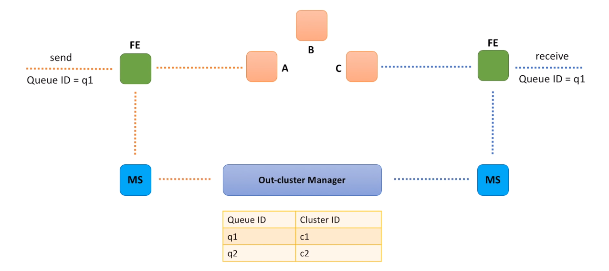

### Option B : Small cluster of independent hosts

- We have a set of small clusters, each cluster consists of 3-4 machines distributed across several data centers.
- When send message request comes, similar to the previous design option, we also need to call Metadata service to identify which cluster is responsible for storing messages for the q1 queue.
- After that we just make a call to a randomly selected instance in the cluster.
- And instance is responsible for data replication across all nodes in the cluster.
- When receive message request comes and we identified which cluster stores messages for the q1 queue, we once again call a randomly selected host and retrieve the message.
- Selected host is responsible for the message cleanup.
- As you may see, we no longer need a component for leader election, but we still need something that will help us to manage queue to cluster assignments.
- Let's call this component an Out-cluster manager.
- And this component will be responsible for maintaining a mapping between queues and clusters.

[Prev - Option A : Leader - Follower Relationship](system-design-interview-distributed-message-queue-option-a-leader-follower-relationship)  

[Next - In-cluster Manager vs Out-cluster Manager](system-design-interview-distributed-message-queue-in-cluster-manager-vs-out-cluster-manager)  
