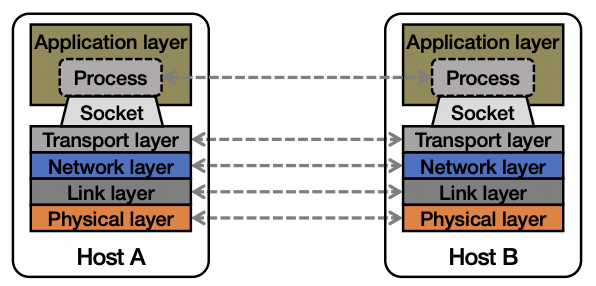

### The problem of communication
- Process on Host A wants to talk to process on Host B
- A and B must agree on the meaning of the bits being sent and received at many different levels, including:
  - How many volts is a 0 bit, a 1 bit?
  - How does receiver know which is the last bit?
  - How many bits long is a number?


- Re-implement every application for every new underlying transmission medium?
- Change every application on any change to an underlying transmission medium?
- No! But how does the Internet design avoid this?

### Solution : Layering


- Intermediate layers provide set of abstractions for applications and media
- New apps or media need only implement for intermediate layer’s interface

### Layering in the Internet 


- Transport: Provide end-to-end communication between processes on different hosts
- Network: Deliver packets to destinations on other (heterogeneous) networks
- Link: Enables end hosts to exchange atomic messages with each other
- Physical: Moves bits between two hosts connected by a physical link

### Logical communication between layers

- How to forge agreement on meaning of bits exchanged b/w two hosts?
- Protocol: Rules that govern format, contents, and meaning of messages
- Each layer on a host interacts with its peer host’s corresponding layer via the protocol interface


### Physical communication

- Communication goes down to the physical network
- Then from network peer to peer
- Then up to the relevant application


### Communication between peers

- How do peer protocols coordinate with each other?
- Layer attaches its own header (H) to communicate with peer
- Higher layers’ headers, data encapsulated inside message
- Lower layers don’t generally inspect higher layers’ headers


### Network socket-based communication

- Socket: The interface the OS provides to the network
  - Provides inter-process explicit message exchange
- Can build distributed systems atop sockets: send(), recv()
  - e.g.: put(key,value) -> message



### Socket programming: still not great

```
// Create a socket for the client
if ((sockfd = socket (AF_INET, SOCK_STREAM, 0)) < 0) {
 perror(”Socket creation");
 exit(2);
}

// Set server address and port
memset(&servaddr, 0, sizeof(servaddr));
servaddr.sin_family = AF_INET;
servaddr.sin_addr.s_addr = inet_addr(argv[1]);
servaddr.sin_port = htons(SERV_PORT); // to big-endian

// Establish TCP connection
if (connect(sockfd, (struct sockaddr *) &servaddr, sizeof(servaddr)) < 0) {
 perror(”Connect to server");
 exit(3);
}

// Transmit the data over the TCP connection
send(sockfd, buf, strlen(buf), 0);
```

- Lots for the programmer to deal with every time
  - How to separate different requests on the same connection?
  - How to write bytes to the network / read bytes from the network?
    - What if Host A’s process is written in Go and Host B’s process is in C++?
  - What to do with those bytes?
- Still pretty painful… have to worry a lot about the network


### Why RPC?

- The typical programmer is trained to write single-threaded code that runs in one place
- Goal: Easy-to-program network communication that makes client-server communication seem transparent
  - Retains the “feel” of writing centralized code
  - Programmer needn’t think (much) about the network

### Everyone uses RPCs

- Google gRPC
- Facebook/Apache Thrift
- Twitter Finagle
- ...

### What’s the goal of RPC?

- Within a single program, running in a single process, recall the well-known notion of a procedure call:
  - Caller pushes arguments onto stack,
    - jumps to address of callee function
  - Callee reads arguments from stack,
    - executes, puts return value in register,
    - returns to next instruction in caller

> RPC’s Goal: make communication appear like a local procedure call: way less painful than sockets

# RPC issues

1. Heterogeneity
   - Client needs to rendezvous with the server
   - Server must dispatch to the required function
     - What if server is different type of machine?
2. Failure
   - What if messages get dropped?
   - What if client, server, or network fails?
3. Performance
   - Procedure call takes ≈ 10 cycles ≈ 3 ns
   - RPC in a data center takes ≈ 10 μs (10^3 slower)
     - In the wide area, typically 10^6 slower

### Problem: Differences in data representation

- Not an issue for local procedure calls
- For a remote procedure call, a remote machine may:
  - Run process written in a different language
  - Represent data types using different sizes
  - Use a different byte ordering (endianness)
  - Represent floating point numbers differently
  - Have different data alignment requirements
    - e.g., 4-byte type begins only on 4-byte memory boundary

### Solution: Interface Description Language

- Mechanism to pass procedure parameters and return values in a machine-independent way
- Programmer may write an interface description in the IDL
  - Defines API for procedure calls: names, parameter/return types
- Then runs an IDL compiler which generates:
  - Code to marshal (convert) native data types into machine-independent byte streams (and vice-versa, called unmarshaling)
  - Client stub: Forwards local procedure call as a request to server
  - Server stub: Dispatches RPC to its implementation

### A day in the life of an RPC

- Client calls stub function (pushes parameters onto stack)


- Stub marshals parameters to a network message


- OS sends a network message to the server


- Server OS receives message, sends it up to stub


- Server stub unmarshals params, calls server function


- Server function runs, returns a value


- Server stub marshals the return value, sends message


- Server OS sends the reply back across the network


- Client OS receives the reply and passes up to stub


- Client stub unmarshals return value, returns to client


### What could possibly go wrong?

- All of these may look the same to the client
  - Client may crash and reboot
  - Packets may be dropped
    - Some individual packet loss in the Internet
    - Broken routing results in many lost packets
  - Server may crash and reboot
  - Network or server might just be very slow

### Summary

- Layers are our friends!
- RPCs are everywhere
- Necessary issues surrounding machine heterogeneity
- Subtle issues around failures
