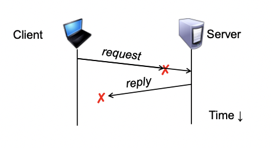
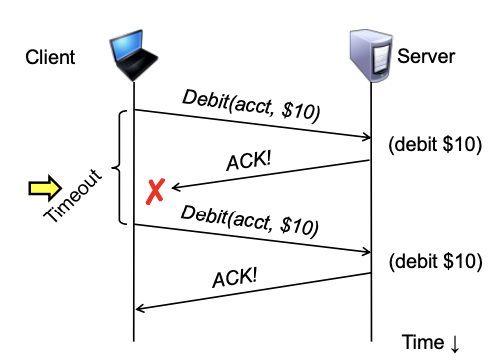
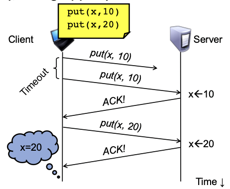
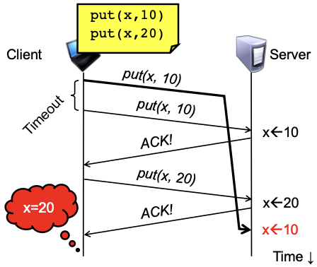

### Failures, from client’s perspective



> The cause of the failure is hidden from the client!

### At-Least-Once scheme

- Simplest scheme for handling failures
1. Client stub waits for a response, for a while
   - Response is an acknowledgement message from the server stub
2. If no response arrives after a fixed timeout time period, then client stub re-sends the request
- Repeat the above a few times
- Still no response? Return an error to the application

### At-Least-Once and side effects

- Client sends a “debit $10 from bank account” RPC



### At-Least-Once and writes

- Consider a client storing key-value pairs in a database
  - put(x, value), then get(x): expect answer to be value





### So is At-Least-Once ever okay?

- Yes: If they are read-only operations with no side effects
  - e.g., read a key’s value in a database
- Yes: If the application has its own functionality to cope with duplication and reordering

### At-Most-Once scheme

-Idea: server RPC stub detects duplicate requests
  - Returns previous reply instead of re-running handler
- How to detect a duplicate request?
  - Test: Server stub sees same function, same arguments twice
    - No! Sometimes applications legitimately submit the same function with same augments, twice in a row

### At-Most-Once scheme

- How to detect a duplicate request?
  - Client stub includes unique transaction ID (xid) with each RPC request
  - Client stub uses same xid for retransmitted requests

```
At-Most-Once Server Stub
 if seen(xid):
   retval = old(xid)
 else:
   retval = handler()
   old(xid) = retval
   seen(xid) = true
 return retval
```

### At-Most-Once: Providing unique XIDs

1. Combine a unique client ID (e.g., IP address) with the current time of day
2. Combine unique client ID with a sequence number
   - Suppose client crashes and restarts. Can it reuse the same client ID?
3. Big random number (probabilistic, not certain guarantee)

### At-Most-Once: Discarding server state

- Problem: seen and old arrays will grow without bound
- Observation: By construction, when the client gets a response to a particular xid, it will never re-send it
- Client could tell server “I’m done with xid x – delete it”
  - Have to tell the server about each and every retired xid
    - Could piggyback on subsequent requests

> Significant overhead if many RPCs are in flight, in parallel

- Suppose xid = ⟨unique client id, sequence no.⟩
  - e.g., ⟨42, 1000⟩, ⟨42, 1001⟩, ⟨42, 1002⟩
- Client includes “seen all replies ≤ X” with every RPC
  - Much like TCP sequence numbers, acks
- How does client know the server received the info about retired RPCs?
  - Each one of these is cumulative: later seen messages subsume earlier ones 

### At-Most-Once: Concurrent requests

- Problem: How to handle a duplicate request while the original is still executing?
  - Server doesn’t know reply yet. And we don’t want to run procedure twice
- Idea: Add a pending flag per executing RPC
  - Server waits for the procedure to finish, or ignores

### At-Most-Once: Server crash and restart

- Problem: Server may crash and restart
- Does server need to write its tables to disk?
- Yes! On server crash and restart:
  - If old, seen tables are only in memory:
    - Server will forget, accept duplicate requests

### Exactly-once?

- Need retransmission of at least once scheme
- Plus the duplicate filtering of at most once scheme
  - To survive client crashes, client needs to record pending RPCs on disk
    - So it can replay them with the same unique identifier
- Plus story for making server reliable
  - Even if server fails, it needs to continue with full state
  - To survive server crashes, server should log to disk results of completed RPCs (to suppress duplicates)

### Exactly-once for external actions?

- Imagine that remote operation triggers an external physical thing
  - e.g., dispense $100 from an ATM
- ATM could crash immediately before or after dispensing
  - ATM would lose its state, and
  - Don’t know which one happened (although can make window very small)
- Can’t achieve exactly-once in general, in presence of external actions

### Summary

- Layers are our friends!
- RPCs are everywhere
- Help support machine heterogeneity
- Subtle issues around failures
  - At-least-once w/ retransmission
  - At-most-once w/ duplicate filtering
    - Discard server state w/ cumulative acks
  - Exactly-once with:
    - at-least-once + at-most-once + fault tolerance + no external actions
