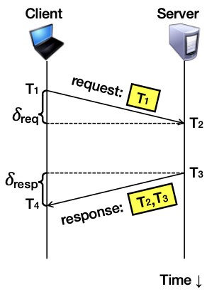
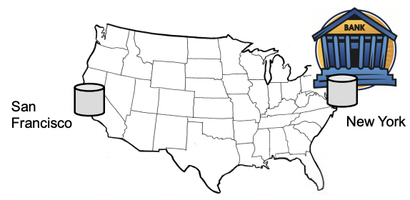
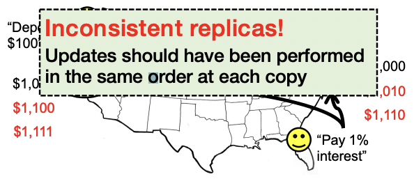
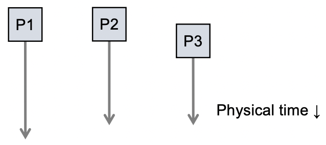
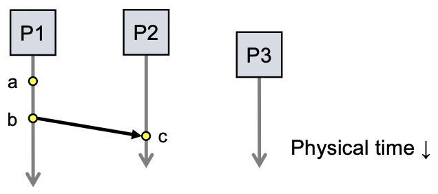
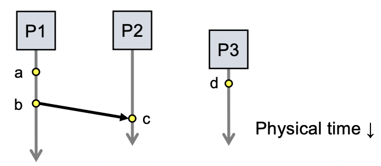
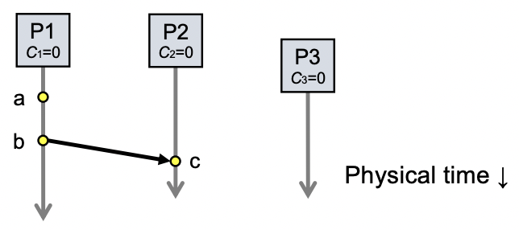
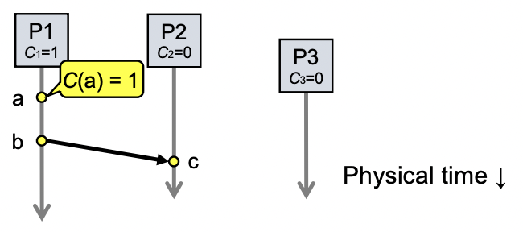
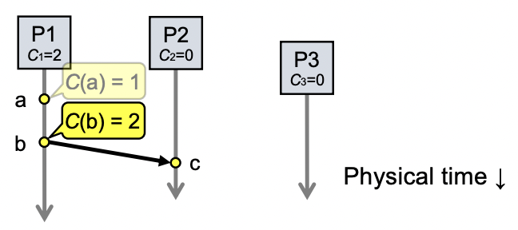
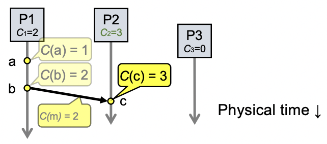

### A distributed edit-compile workflow

- 2143 < 2144 -> make doesn’t call compiler

> Lack of time synchronization result: a possible object file mismatch

### What makes time synchronization hard?

1. Quartz oscillator sensitive to temperature, age, vibration, radiation
   - Accuracy ~one part per million: one second of clock drift over 12 days
2. The internet is:
   - Asynchronous: arbitrary message delays
   - Best-effort: messages don’t always arrive

### Just use Coordinated Universal Time

- UTC is broadcast from radio stations on land and satellite (e.g., the Global Positioning System)
  - Computers with receivers can synchronize their clocks with these timing signals
- Signals from land-based stations are accurate to about 0.1−10 milliseconds
- Signals from GPS are accurate to about one microsecond
  - Why can’t we put GPS receivers on all our computers?

### Synchronization to a time server

- Suppose a server with an accurate clock (e.g., GPS-receiver)
  - Could simply issue an RPC to obtain the time:

- But this doesn’t account for network latency
  - Message delays will have outdated server’s answer

### Cristian’s algorithm: Outline Client Server

1. Client sends a request packet, timestamped with its local clock T1
2. Server timestamps its receipt of the request T2 with its local clock
3. Server sends a response packet with its local clock T3 and T2
4. Client locally timestamps its receipt of the server’s response T4

> How can the client use these timestamps to synchronize its local clock to the server’s local clock?

### Cristian’s algorithm: Offset sample calculation

> Goal: Client sets clock <- T3 + &resp

- Client samples round trip time (𝛿)
  - 𝛿 = 𝛿req + 𝛿resp = (T4 − T1) − (T3 − T2)
- But client knows 𝛿, not 𝛿resp

> Assume: 𝛿req ≈ 𝛿resp

> Client sets clock <- T3 + ½𝛿

### Clock synchronization: Take-away points

- Clocks on different systems will always behave differently
  - Disagreement between machines can result in undesirable behavior
- NTP clock synchronization
  - Rely on timestamps to estimate network delays
  - 100s �s−ms accuracy
  - Clocks never exactly synchronized
- Often inadequate for distributed systems
  - Often need to reason about the order of events
  - Might need precision on the order of ns 

### Motivation: Multi-site database replication

- A New York-based bank wants to make its transaction ledger database resilient to whole-site failures
- Replicate the database, keep one copy in sf, one in nyc

### The consequences of concurrent updates

- Replicate the database, keep one copy in sf, one in nyc
  - Client sends reads to the nearest copy
  - Client sends update to both copies

### RFC 677 (1975) - The Maintenance of Duplicate Databases

> To the extent that the communication paths can be made reliable, and the clocks used by the processes kept close to synchrony, the probability of seemingly strange behavior can be made very small. However, the distributed nature of the system dictates that this probability can never be zero.

### Idea: Logical clocks

- Landmark 1978 paper by Leslie Lamport
- Insight: only the events themselves matter

> Idea: Disregard the precise clock time. Instead, capture just a “happens before” relationship between a pair of events

### Defining “happens-before” (<-)

- Consider three processes: P1, P2, and P3
- Notation: Event a happens before event b (a -> b)

- Can observe event order at a single process

1. If same process and a occurs before b, then a -> b
2. If c is a message receipt of b, then b -> c
3. If a -> b and b -> c, then a -> c
4. Can observe ordering transitively

### Concurrent events

- Not all events are related by ->
- a, d not related by -> so concurrent, written as a || d

### Lamport clocks: Objective

- We seek a clock time C(a) for every event a

> Plan: Tag events with clock times; use clock times to make distributed system correct

- Clock condition: If a -> b, then C(a) < C(b)

### The Lamport Clock algorithm

- Each process Pi maintains a local clock Ci

1. Before executing an event, Ci <- Ci + 1

- Set event time C(a) <- Ci

- Set event time C(b) <- Ci

2. Send the local clock in the message m

3. On process Pj receiving a message m:
   - Set Cj and receive event time C(c) <- 1 + max{ Cj, C(m) }

