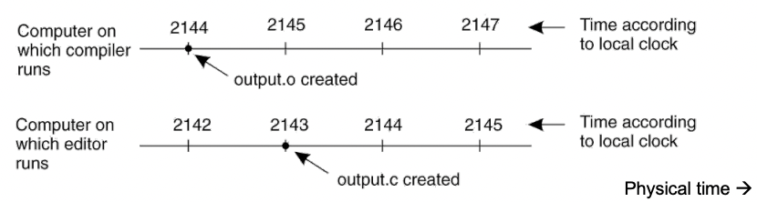
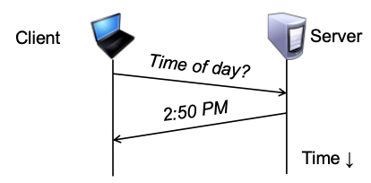
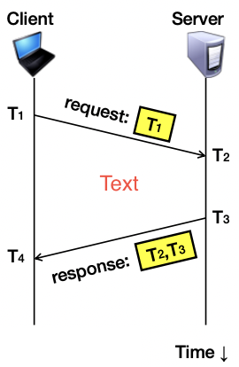

### A distributed edit-compile workflow

- 2143 < 2144 -> make doesn’t call compiler

> Lack of time synchronization result: a possible object file mismatch

### What makes time synchronization hard?

1. Quartz oscillator sensitive to temperature, age, vibration, radiation
   - Accuracy ~one part per million: one second of clock drift over 12 days
2. The internet is:
   - Asynchronous: arbitrary message delays
   - Best-effort: messages don’t always arrive

### Just use Coordinated Universal Time

- UTC is broadcast from radio stations on land and satellite (e.g., the Global Positioning System)
  - Computers with receivers can synchronize their clocks with these timing signals
- Signals from land-based stations are accurate to about 0.1−10 milliseconds
- Signals from GPS are accurate to about one microsecond
  - Why can’t we put GPS receivers on all our computers?

### Synchronization to a time server

- Suppose a server with an accurate clock (e.g., GPS-receiver)
  - Could simply issue an RPC to obtain the time:

- But this doesn’t account for network latency
  - Message delays will have outdated server’s answer

### Cristian’s algorithm: Outline Client Server

1. Client sends a request packet, timestamped with its local clock T1
2. Server timestamps its receipt of the request T2 with its local clock
3. Server sends a response packet with its local clock T3 and T2
4. Client locally timestamps its receipt of the server’s response T4

> How can the client use these timestamps to synchronize its local clock to the server’s local clock?

