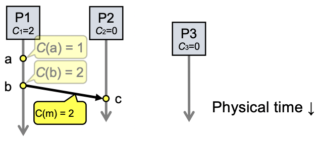
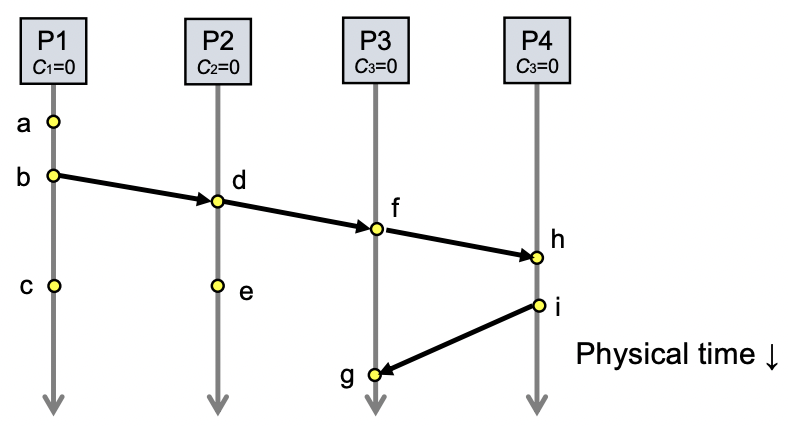
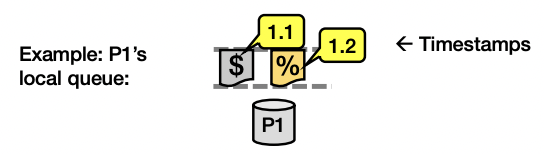
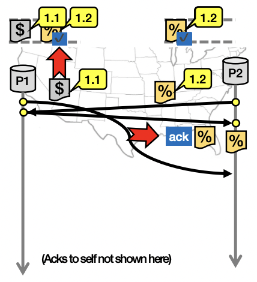
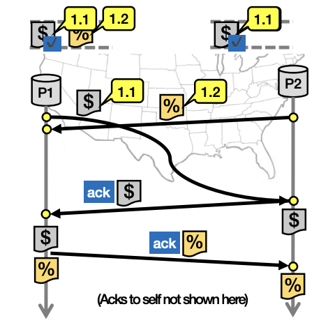
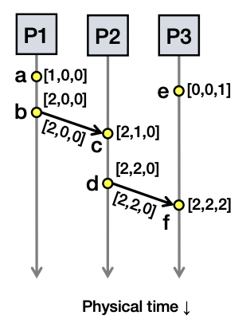
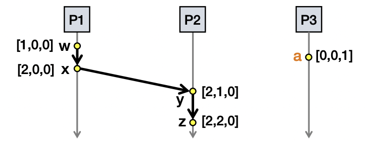

### A distributed edit-compile workflow

- 2143 < 2144 -> make doesn’t call compiler

> Lack of time synchronization result: a possible object file mismatch

### What makes time synchronization hard?

1. Quartz oscillator sensitive to temperature, age, vibration, radiation
   - Accuracy ~one part per million: one second of clock drift over 12 days
2. The internet is:
   - Asynchronous: arbitrary message delays
   - Best-effort: messages don’t always arrive

### Just use Coordinated Universal Time

- UTC is broadcast from radio stations on land and satellite (e.g., the Global Positioning System)
  - Computers with receivers can synchronize their clocks with these timing signals
- Signals from land-based stations are accurate to about 0.1−10 milliseconds
- Signals from GPS are accurate to about one microsecond
  - Why can’t we put GPS receivers on all our computers?

### Synchronization to a time server

- Suppose a server with an accurate clock (e.g., GPS-receiver)
  - Could simply issue an RPC to obtain the time:

- But this doesn’t account for network latency
  - Message delays will have outdated server’s answer

### Cristian’s algorithm: Outline Client Server

1. Client sends a request packet, timestamped with its local clock T1
2. Server timestamps its receipt of the request T2 with its local clock
3. Server sends a response packet with its local clock T3 and T2
4. Client locally timestamps its receipt of the server’s response T4

> How can the client use these timestamps to synchronize its local clock to the server’s local clock?

### Cristian’s algorithm: Offset sample calculation

> Goal: Client sets clock <- T3 + 𝛿resp

- Client samples round trip time (𝛿)
  - 𝛿 = 𝛿req + 𝛿resp = (T4 − T1) − (T3 − T2)
- But client knows 𝛿, not 𝛿resp

> Assume: 𝛿req ≈ 𝛿resp

> Client sets clock <- T3 + ½𝛿

### Clock synchronization: Take-away points

- Clocks on different systems will always behave differently
  - Disagreement between machines can result in undesirable behavior
- NTP clock synchronization
  - Rely on timestamps to estimate network delays
  - 100s �s−ms accuracy
  - Clocks never exactly synchronized
- Often inadequate for distributed systems
  - Often need to reason about the order of events
  - Might need precision on the order of ns 

### Motivation: Multi-site database replication

- A New York-based bank wants to make its transaction ledger database resilient to whole-site failures
- Replicate the database, keep one copy in sf, one in nyc

### The consequences of concurrent updates

- Replicate the database, keep one copy in sf, one in nyc
  - Client sends reads to the nearest copy
  - Client sends update to both copies

### RFC 677 (1975) - The Maintenance of Duplicate Databases

> To the extent that the communication paths can be made reliable, and the clocks used by the processes kept close to synchrony, the probability of seemingly strange behavior can be made very small. However, the distributed nature of the system dictates that this probability can never be zero.

### Idea: Logical clocks

- Landmark 1978 paper by Leslie Lamport
- Insight: only the events themselves matter

> Idea: Disregard the precise clock time. Instead, capture just a “happens before” relationship between a pair of events

### Defining “happens-before” (<-)

- Consider three processes: P1, P2, and P3
- Notation: Event a happens before event b (a -> b)

- Can observe event order at a single process

1. If same process and a occurs before b, then a -> b
2. If c is a message receipt of b, then b -> c
3. If a -> b and b -> c, then a -> c
4. Can observe ordering transitively

### Concurrent events

- Not all events are related by ->
- a, d not related by -> so concurrent, written as a / d

### Lamport clocks: Objective

- We seek a clock time C(a) for every event a

> Plan: Tag events with clock times; use clock times to make distributed system correct

- Clock condition: If a -> b, then C(a) < C(b)

### The Lamport Clock algorithm

- Each process Pi maintains a local clock Ci

1. Before executing an event, Ci <- Ci + 1

- Set event time C(a) <- Ci

- Set event time C(b) <- Ci

2. Send the local clock in the message m

3. On process Pj receiving a message m:
   - Set Cj and receive event time C(c) <- 1 + max{ Cj, C(m) }

### Lamport Timestamps: Ordering all events

- Break ties by appending the process number to each event:
  1. Process Pi timestamps event e with Ci(e).i
  2. C(a).i < C(b).j when:
  - C(a) < C(b), or C(a) = C(b) and i < j
- Now, for any two events a and b, C(a) < C(b) or C(b) < C(a)
  - This is called a total ordering of events

### Order all these events

### Take-away points: Lamport clocks

- Can totally-order events in a distributed system: that’s useful!
  - We saw an application of Lamport clocks for totally-ordered multicast
- But: while by construction, a -> b implies C(a) < C(b),
  - The converse is not necessarily true:
    - C(a) < C(b) does not imply a -> b (possibly, a / b)

> Can’t use Lamport timestamps to infer causal relationships between events

### Totally-Ordered Multicast

> Goal: All sites apply updates in (same) Lamport clock order

- Client sends update to one replica site j
 - Replica assigns it Lamport timestamp Cj . j
- Key idea: Place events into a sorted local queue
  - Sorted by increasing Lamport timestamps

### Totally-Ordered Multicast (Almost correct)

1. On receiving an update from client, broadcast to others (including self)
2. On receiving an update from replica:
   - Add it to your local queue
   - Broadcast an acknowledgement message to every replica (including yourself)
3. On receiving an acknowledgement:
   - Mark corresponding update acknowledged in your queue
4. Remove and process updates everyone has ack’ed from head of queue

- P1 queues $, P2 queues %
- P1 queues and ack’s %
- P1 marks %fully ack’ed
- P2 marks % fully ack’ed

> ✘ P2 processes %

### Totally-Ordered Multicast (Correct Version)

1. On receiving an update from client, broadcast to others (including self)
2. On receiving or processing an update:
   - Add it to your local queue, if received update
   - Broadcast an acknowledgement message to every replica (including yourself) only from head of queue
3. On receiving an acknowledgement:
   - Mark corresponding update acknowledged in your queue
4. Remove and process updates everyone has ack’ed from head of queue

### So, are we done?

- Does totally-ordered multicast solve the problem of multi-site replication in general?
- Not by a long shot!

1. Our protocol assumed:
   - No node failures
   - No message loss
   - No message corruption
2. All to all communication does not scale
3. Waits forever for message delays (performance?)

### Lamport Clocks Review

- Q: a -> b => LC(a) < LC(b)
- Q: LC(a) < LC(b) => b -/-> a ( a -> b or a / b )
- Q: a / b => nothing

### Lamport Clocks and Causality

- Lamport clock timestamps do not capture causality
- Given two timestamps C(a) and C(z), want to know whether there’s a chain of events linking them:
  - a -> b -> ... -> y -> z

### Vector clock: Introduction

- One integer can’t order events in more than one process
- So, a Vector Clock (VC) is a vector of integers, one entry for each process in the entire distributed system
- Label event e with VC(e) = (c1, c2 …, cn)
  - Each entry ck is a count of events in process k that causally precede e

### Vector clock: Update rules

- Initially, all vectors are (0, 0, …, 0)
- Two update rules:
  1. For each local event on process i, increment local entry ci
  2. If process j receives message with vector (d1, d2, …, dn):
     - Set each local entry ck = max{ck, dk}
     - Increment local entry cj

### Vector clock: Example

- All processes’ VCs start at (0, 0, 0)
- Applying local update rule
- Applying message rule
  - Local vector clock piggybacks on inter-process messages

### Vector clocks capture causality

- V(w) < V(z) then there is a chain of events linked by
  - Happens-Before (->) between a and z
- V(a) / V(w) then there is no such chain of events between a and w

### Comparing vector timestamps

- Rule for comparing vector timestamps:
  - V(a) = V(b) when ak = bk for all k
  - V(a) < V(b) when ak ≤ bk for all k and V(a) ≠ V(b)
    - a -> b
- Concurrency:
  - V(a) / V(b) if ai < bi and aj > bj , some i, j
    - a / b

- Two events a, z
  - Lamport clocks: C(a) < C(z)
    - Conclusion: z -/-> a, i.e., either a -> z or a / z
  - Vector clocks: V(a) < V(z)
    - Conclusion: a -> z

> Vector clock timestamps precisely capture happens-before relation (potential causality)
