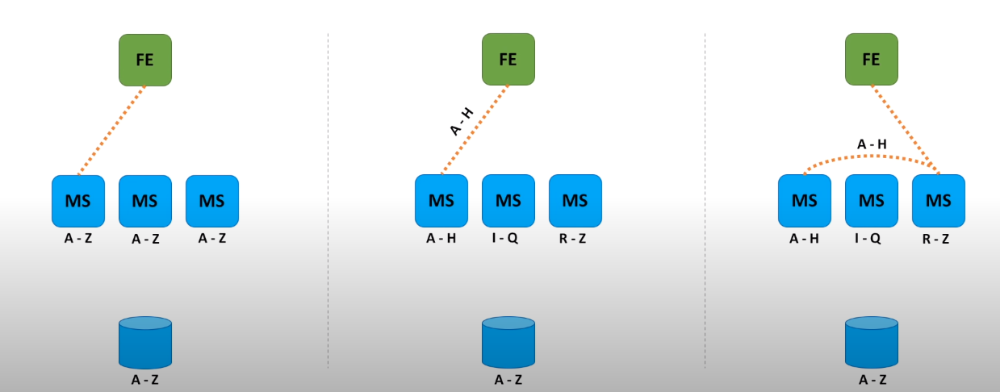

### Metadata Service

- Metadata service stores information about queues. 
- Every time queue is created, we store information about it in the database. Conceptually, Metadata service is a caching layer between the FrontEnd and a persistent
storage.
- It handles many reads and a relatively small number of writes. As we read every time message arrives and write only when new queue is created.
- Even though strongly consistent storage is preferred to avoid potential concurrent updates, it is not strictly required.
- Different approaches of organizing cache clusters:
  - The first option is when cache is relatively small and we can store the whole data set on every cluster node. FrontEnd host calls a randomly chosen Metadata service host, because all the cache cluster nodes contain the same information.
  - Second approach is to partition data into small chunks, called shards. Because data set is too big and cannot be placed into a memory of a single host. So, we store each such chunk of data on a separate node in a cluster. FrontEnd then knows which shard stores the data and calls the shard directly.
  - And the third option is similar to the second one. We also partition data into shards, but FrontEnd does not know on what shard data is stored. So, FrontEnd calls a random Metadata service host and host itself knows where to forward the request to.
- In option one, we can introduce a load balancer between FrontEnd and Metadata service. As all Metadata service hosts are equal and FrontEnd does not care which Metadata host
handles the request.
- In option two and three, Metadata hosts represent a consistent hashing ring.

[Prev - FrontEnd Service](system-design-interview-distributed-message-queue-frontend-service)  	

[Next - BackEnd Service](system-design-interview-distributed-message-queue-backend-service)  
